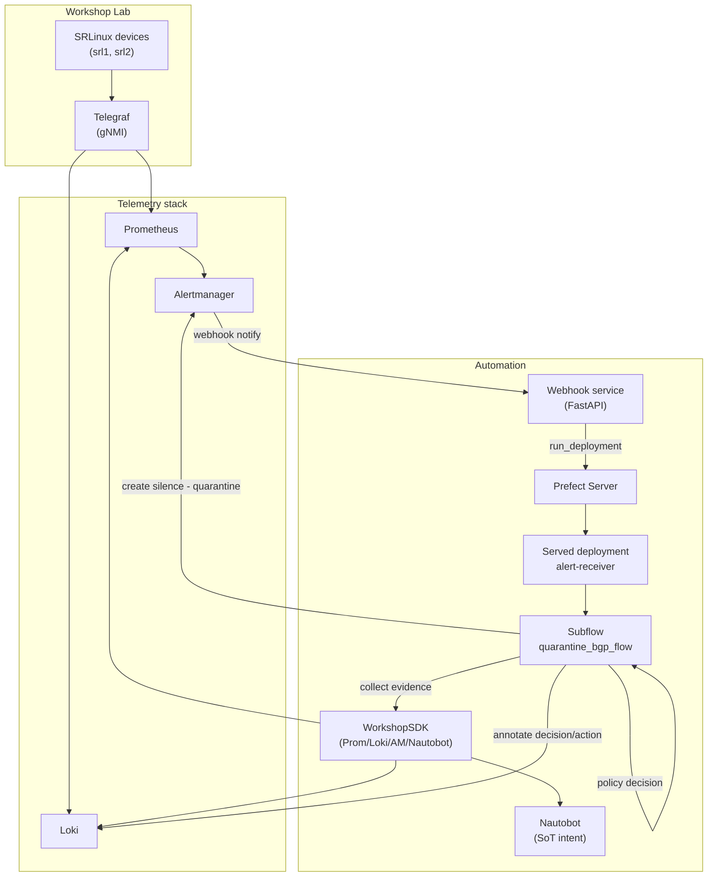
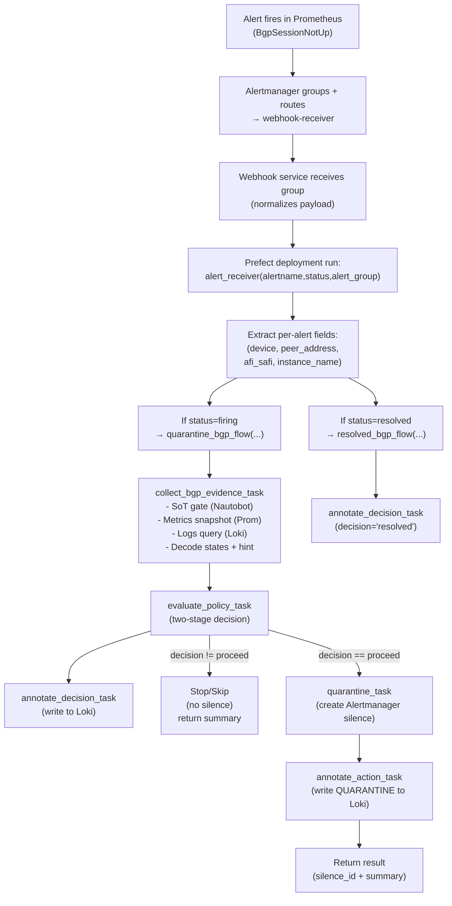
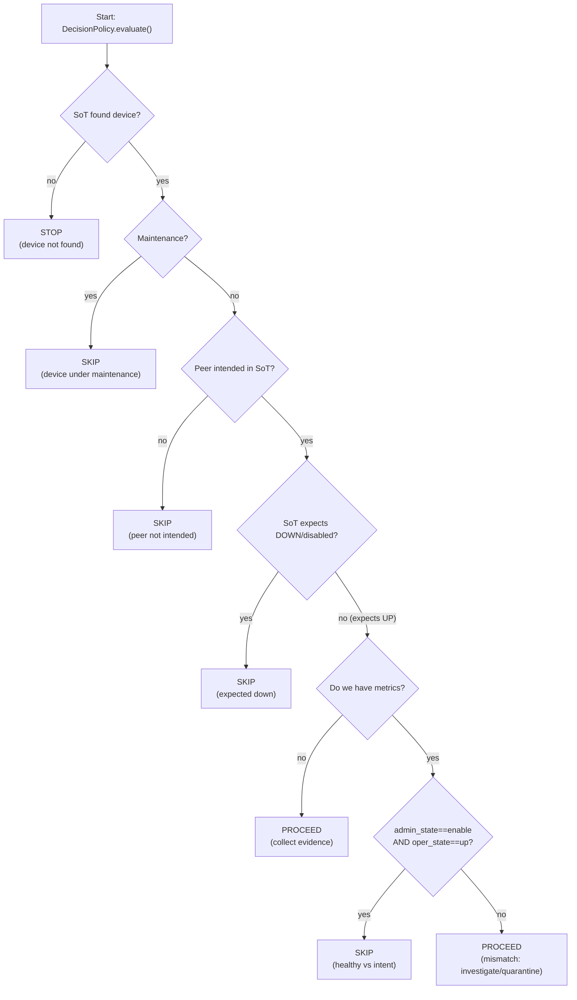

# 📘 Workshop 4 - Automation on Top of Observability Data

## Student Guide & SDK Companion

This guide is your **starting point for Workshop 4**.
Its goal is to help you **explore observability data programmatically**, understand it, and **only then** turn it into automation using workflows.

This workshop is intentionally designed to be **interactive and exploratory first**, and **automated later**.

> **Mental model for this workshop**
> **Understand the data → reason about it → decide → automate**

---

## How this workshop is meant to be used

You are not expected to jump straight into Prefect flows.

Instead, the recommended learning path is:

> **IPython → SDK exploration → understanding results → decisions → Prefect flow**

Why?

Because **automation without understanding the data is dangerous**.
By the end of this workshop, you should feel comfortable answering questions like:

- *What data do I actually have?*
- *Is this a real issue or just noise?*
- *What evidence supports an action?*
- *Why did an automation run (or not run)?*

This guide walks you through that process step by step.

---

## 0) IMPORTANT: Connect to the existing Prefect server

⚠️ **This step is critical and easy to miss.**

The workshop environment already has a **running Prefect server**.
Before starting IPython or running any flows, you must tell Prefect to use it.

Run the following **in your shell**:

```bash
# Navigate to the workshop code directory
cd ~/network-observability-lab/chapters/webinar

# Point Prefect to the existing local server
prefect config set PREFECT_API_URL=http://localhost:4200/api
```

Verify it is set correctly:

```bash
prefect config view
```

You should see `PREFECT_API_URL: http://localhost:4200/api` in the output.

### Why this matters

⚠️ If `PREFECT_API_URL` is not set, Prefect may:

- fall back to an ephemeral local server,
- start background services unexpectedly,
- or behave inconsistently between shell sessions.

Always export this before running ipython.

## 1) Start IPython (outside Prefect)

This workshop intentionally starts **outside Prefect** flows so you can:

- inspect real telemetry,
- run queries interactively,
- tweak parameters quickly,
- and understand return values without orchestration overhead.

```bash
ipython
```

Think of IPython as your **observability REPL**.

## 2) Import the Workshop SDK

Once inside IPython, load the SDK:

```python
from rich.pretty import install
install()

from netobs_workshop_sdk import (
    WorkshopSDK,
    EvidenceBundle,
    DecisionPolicy,
    Decision,
)
sdk = WorkshopSDK()
```

### What does the SDK provide?

The SDK provides **structured access to the observability stack**:

- `sdk.prom` → Prometheus instant queries
- `sdk.loki` → LogQL queries + annotations
- `sdk.am` → Alertmanager silences
- `sdk.nb` → Nautobot SoT (Device information + Intent)

Core concepts you will use throughout the workshop:

- `EvidenceBundle`: A structured container that groups:
  - SoT intent,
  - BGP metrics snapshot,
  - BGP logs
- `DecisionPolicy`: Encodes *why* an action should (or should not) be taken.
- `Decision`: Represents the outcome of applying a policy to evidence.

> NOTE: You will explore these objects interactively before using them inside Prefect flows.

## 3) Workshop conventions (important)

To avoid confusion, this lab follows **strict conventions**. Understanding them will save you a lot of debugging time.

### BGP metric labels

In this lab, the BGP metrics are labeled like:

- `device="srl1"`
- `peer_address="10.1.2.2"`
- `afi_safi_name="ipv4-unicast"`
- `name="default"` ✅ **this is the routing instance name**

So when using the SDK:

- always use `instance_name="default"`
- always use `afi_safi="ipv4-unicast"`

### BGP state enum mapping (decoded meaning)

BGP admin and operational states come from **Telegraf enum mapping**:

- `admin_state`: `enable=1`, `disable=2`
- `oper_state`: `up=1`, `down=2`, `idle=3`, `connect=4`, `active=5`

The SDK helps you interpret this automatically.

Each `EvidenceBundle.summary()` includes:

- `metrics_hint`: A human-readable hint derived from metrics only. For example "admin up but oper down → likely session not established"
- `decoded`: A friendly decode of admin and oper state values.

These hints are intentionally **opinionated but explainable** — you can inspect the raw data at any time.

## 4) Explore SoT (Nautobot): Device + Maintenance + Config Context

Before we look at metrics or logs, we always start with **intent and context**.

In this workshop, Nautobot represents our **Source of Truth (SoT)**:

- what devices exist,
- whether they are under maintenance,
- and what we *expect* them to be doing.

Automation without this context is risky — so we always ask:
> *"What is supposed to be true?"*

### Fetch a device

```python
dev = sdk.nb.get_device("srl1")
dev["name"]
```

This returns the raw **Nautobot device object** as a Python dictionary.

At this point, you are looking at:

- inventory data,
- custom fields,
- and configuration context attached to the device.

Nothing is interpreted yet — this is *pure source-of-truth data*.

### Check the maintenance flag (custom field)

```python
sdk.nb.is_device_in_maintenance(dev)
```

This answers a critical operational question:
> Is this device currently under maintenance?

Why this matters:

- If a device is in maintenance, alerts may be expected.
- Automation may need to pause, downgrade, or skip actions entirely.

You'll see this flag used later as a **gate** in decision-making.

### Inspect the local configuration context

```python
ctx = dev.get("local_config_context_data") or {}
ctx
```

The **local config context** is where intent lives:

- expected BGP peers,
- desired operational state,
- role-based expectations.

Think of this as:
> "What does the network design say should be happening?"

You don't need to fully understand the structure yet — just know that:

- this data feeds decisions,
- and it is intentionally separate from telemetry.

## 5) Check the *intent* for a BGP peer

Now that we understand the device context, we can ask a more precise question:
> Is this specific BGP peer expected to exist and be established?

This is where **intent gates** come in.

```python
gate = sdk.nb.build_bgp_intent_gate(device="srl1", peer_address="10.1.2.2", afi_safi="ipv4-unicast")
gate
```

This function combines multiple SoT signals into a **single structured answer**.

You should see something like:

```python
{
    'found': True,
    'maintenance': False,
    'intended_peer': True,
    'expected_state': 'established',
    'session': {
        'peer_ip': '10.1.2.2',
        'remote_as': 65102,
        'expected_state': 'established',
        'expected_prefixes_received': 10
    },
    'device': 'srl1',
    'site': None,
    'role': None
}
```

### How to read this result

Key fields to focus on:

- `found`: The device exists in SoT.
- `maintenance`: Whether the device is under maintenance.
- `intended_peer`: Whether this BGP peer is *intentionally configured*.
- `expected_state`: Our *desired* BGP session state (intent).

> ⚠️ At this point, we still haven't looked at metrics or logs.
> This is pure intent, not reality.

## 6) Check the *reality* for a BGP peer (metrics + logs)

Now we switch perspectives.

We have answered:
> "What should be happening?"

Next, we ask:
> "What is actually happening right now?"

This comes from **telemetry**, not the Source of Truth.

### Get BGP Prometheus queries

```python
qs = sdk.bgp_queries(
    device="srl1",
    peer_address="10.1.2.2",
    afi_safi="ipv4-unicast",
    instance_name="default",
)
qs
```

This returns a dictionary of PromQL queries, one per BGP signal:

- admin state
- operational state
- routes received
- routes sent
- and more

This step is intentional:

- you can see the exact queries,
- and validate what data is being pulled.

### Run the BGP Prometheus queries

```python
for k, q in qs.items():
    res = sdk.prom.instant(q)
    print(k, "=>", res[:1])
```

It should show the resulting metrics, for example:

```python
admin_state => [{
  'metric': {
    '__name__': 'bgp_admin_state',
    'afi_safi_name': 'ipv4-unicast',
    'device': 'srl1',
    'peer_address': '10.1.2.2',
    'name': 'default'
  },
  'value': [1769585404.363, '1']
}]
```

At this level:

- values are still strings,
- enums are not decoded,
- and interpretation is left to you.

This is *raw reality*.

### Get Normalized BGP metrics snapshot

To make this easier to reason about, the SDK provides a **normalized snapshot**:

```python
m = sdk.bgp_metrics_snapshot(
    device="srl1",
    peer_address="10.1.2.2",
    afi_safi="ipv4-unicast",
    instance_name="default",
)
m
```

Example output:

```python
{
    'admin_state': 1.0,
    'oper_state': 1.0,
    'received_routes': 10.0,
    'sent_routes': 10.0,
    'suppressed_routes': 0.0,
    'active_routes': 0.0
}
```

This is the same data, but:

- parsed,
- normalized,
- and ready for decision logic.

> Think of this as "metrics you can safely automate on."

### Fetch recent BGP logs from Loki

Metrics tell us what is happening. Logs often explain why.

You can inspect the LogQL query used:

```python
sdk.bgp_logql(device="srl1", peer_address="10.1.2.2")
```

### (Optional) Generate some BGP logs

If there are no recent logs, you can create activity by flapping the session:

```bash
# Navigate to the workshop code directory
cd ~/network-observability-lab

# Flap the BGP interface to generate logs
netobs utils device-interface-flap \
   --device srl1 \
   --interface ethernet-1/1 \
   --count 2 \
   --delay 2 \
   --platform nokia_srl
```

This is safe in the lab and helps demonstrate log-driven evidence.

### Fetch recent logs for the BGP peer

```python
logs = sdk.bgp_logs(
    device="srl1",
    peer_address="10.1.2.2",
    minutes=30,
    limit=50,
)
len(logs)
```

You now have:

- intent from SoT,
- metrics from Prometheus,
- logs from Loki.

## 7) Correlation: Build an EvidenceBundle (SoT + metrics + logs)

This section is the **core of the workshop**.

Up to now, you've looked at:

- intent (Source of Truth),
- metrics (Prometheus),
- logs (Loki),

**individually**.

Real operational decisions, however, are *never* made from a single signal.

> **Correlation is the moment observability becomes useful for automation.**

The goal here is to **collect all relevant signals for a BGP peer into one object** called an **`EvidenceBundle`**.

### Collect evidence for a BGP peer

```python
ev = sdk.collect_bgp_evidence(
    device="srl1",
    peer_address="10.1.2.2",
    afi_safi="ipv4-unicast",
    instance_name="default",
    log_minutes=30,
    log_limit=50,
)
```

What this does under the hood:

- pulls **intent + maintenance** from SoT,
- collects **normalized BGP metrics** from Prometheus,
- fetches **recent BGP-related logs** from Loki,
- packages everything into a **single structured object**.

No decisions yet. No automation yet. **Just evidence**.

### Get a high-level summary

```python
ev.summary()
```

Example output:

```python
{
    'device': 'srl1',
    'peer_address': '10.1.2.2',
    'afi_safi': 'ipv4-unicast',
    'instance_name': 'default',
    'bgp_metrics_hint': 'Routes received but none active → import policy/validation rejecting routes.',

    'metrics': {
        'admin_state': 1.0,
        'oper_state': 1.0,
        'received_routes': 10.0,
        'sent_routes': 10.0,
        'suppressed_routes': 0.0,
        'active_routes': 0.0
    },

    'log_lines': 4,

    'sot': {
        'found': True,
        'maintenance': False,
        'intended_peer': True,
        'expected_state': 'established',
        'site': None,
        'role': None
    },

    'decoded': {
        'admin_state': 'enable',
        'oper_state': 'up'
    }
}
```

#### How to read this summary

Focus on **relationships**, not individual values:

- **SoT says** the peer should be established
- **Metrics say** the session is up, but routes aren't active
- **Logs exist**, meaning there's likely recent activity
- `bgp_metrics_hint` gives you a *machine-generated hypothesis*

This is exactly the kind of reasoning a human operator does:

> "The session is up… but something is wrong with routes."

Now we have captured that reasoning in a **structured, inspectable object**.

### Explore the raw signals (important)

You are encouraged to inspect the raw evidence directly:

```python
ev.metrics    # Prometheus-derived signals
ev.logs       # Raw log lines from Loki
ev.sot        # Source-of-Truth (Nautobot intent + maintenance)
```

This is where learning really happens.

Try to observe:

- what disappears during a flap,
- what counters drop to zero,
- how logs spike or go silent,
- how intent stays stable while reality changes.

> Automation should never hide the raw data — it should build on top of it.

## 8) Make decisions based on evidence

Now that we have evidence, we can answer the next question:
> Given what we know — should we act?

This is where `DecisionPolicy` comes in.

A policy:

- evaluates evidence,
- explains why a decision is made,
- and returns a structured result.

### SoT-only Policy (early gate)

Use this when you only want to decide:
> "Should this peer even be considered?"

```python
policy = DecisionPolicy()
decision = policy.evaluate(ev.sot)
decision
```

Example output:

```python
Decision(ok=True, decision='proceed', reason='SoT expects up; metrics not provided (collect evidence)', details={})
```

#### Typical SoT-only outcomes

- `stop`
  - → device not found in SoT
- `skip`
  - → device in maintenance
  - → peer not intended
  - → SoT explicitly expects the peer to be down
- `proceed`
  - → SoT expects the peer to be up
  - → it makes sense to look at metrics and logs

This protects your automation from acting on **irrelevant or expected conditions**.

### Metrics + SoT Policy (intent vs reality)

Now let's validate **intent against reality**:

```python
policy = DecisionPolicy()
decision = policy.evaluate(ev.sot, ev.metrics)
decision
```

Example output:

```python
Decision(
  ok=False,
  decision="skip",
  reason="peer matches SoT intent (enabled + up)",
  details={}
)
```

In this case:

- intent and metrics agree,
- nothing is broken,
- doing nothing is the correct action.

> Automation includes knowing when not to act.

### Broken peer example (recommended exercise)

Repeat the process with a broken peer:

```python
ev_broken = sdk.collect_bgp_evidence(
    device="srl2",
    peer_address="10.1.11.1",
    afi_safi="ipv4-unicast",
    instance_name="default",
    log_minutes=30,
    log_limit=50,
)
policy = DecisionPolicy()
decision_broken = policy.evaluate(ev_broken.sot, ev_broken.metrics)
decision_broken
```

Compare:

- intent vs metrics,
- healthy vs broken peer,
- logs presence and patterns.

> NOTE: You can also flap the session on `srl2` to generate logs if needed.

## 9) Apply an action (Alertmanager quarantine)

Only **after**:

- intent is understood,
- evidence is correlated,
- and a policy says "this is actionable",
- do we apply an action.

In this workshop, the action is a temporary Alertmanager silence (used here as a *quarantine* mechanism).

### Apply the quarantine action

```python
silence_id = sdk.quarantine_bgp(
    device=ev.device,
    peer_address=ev.peer_address,
    minutes=20,
)
silence_id
```

Example output:

```python
'c1f3b2e4-5d6a-4f7b-8c9d-0e1f2a3b4c5d'
```

This creates a silence that:

- **suppresses** alerts related to this peer,
- gives operators time to investigate or remediate,
- and is **fully traceable and reversible**.

### Verify the silence

You can confirm the quarantine in the Alertmanager UI:

```bash
http://<your-alertmanager-host>:9093/#/silences
```

You should see a silence matching the `silence_id` returned earlier.

## 11) Record what happened (annotations in Loki)

Up to now, we have:

- understood intent,
- collected evidence,
- made a decision,
- and applied an action.

There's one final (often forgotten) step:
> **Make the system remember *why* something happened.**

This is where **annotations** come in. Annotations help turn the automation from a *black box* into an *auditable system*.

### Why annotate?

Annotations allow you to:

- explain actions after the fact,
- correlate automation with metrics and logs,
- create an operational timeline,
- and support future RCA and post-mortems.

In this workshop, annotations are written to **Loki**, but the idea applies everywhere.

### General annotation (what happened)

Use this when you want to record that an action occurred:

```python
sdk.annotate(
    labels={
        "source": "prefect",
        "workflow": "demo_quarantine_bgp",
        "device": ev.device,
        "peer_address": ev.peer_address,
    },
    message=f"QUARANTINE applied (silence_id={silence_id})",
)
```

This creates a log entry that:

- is searchable,
- is timestamped,
- and can be overlaid on dashboards or timelines.

Think of it as:
> "An operator left a sticky note in the system."

### Decision-specific annotation (why)

Sometimes it's more important to record why something did not happen. For that, use a decision-focused annotation:

```python
sdk.annotate_decision(
    workflow="demo_quarantine_bgp",
    device=ev.device,
    peer_address=ev.peer_address,
    decision="skip",
    message="SKIP quarantine: peer not intended in SoT",
)
```

This explicitly captures:

- the workflow involved,
- the decision taken,
- and the reasoning behind it.

> Silence without explanation is dangerous. A skipped action with a reason is observability.

## 12) RCA payload (optional, LLM-ready)

At this point, everything we have built is:

- structured,
- correlated,
- and explainable.

This makes it ideal input for Root Cause Analysis (RCA) — human or automated.

```python
payload = ev.to_rca_payload()
payload.keys()
```

This payload is a compact, correlated snapshot of intent, metrics, and logs for the BGP peer.

Because the data is already normalized and scoped, it can be consumed directly by a Prefect task, a human operator, or an LLM-based RCA step.

---

## Running the full Prefect flow

Once you are comfortable with the individual SDK steps, run the **end-to-end Prefect flow** that automates everything.

```bash
# Navigate to the workshop code directory
cd ~/network-observability-lab/chapters/webinar-completed

# Start the served deployment (the flow will wait for alert payloads)
python student_flow.py
```

This serves the `alert-receiver` deployment and waits for alert payloads. When an alert arrives, the workflow:

- parses the Alertmanager payload,
- extracts the `device` + `peer_address`,
- collects evidence (SoT + metrics + logs),
- evaluates the decision policy,
- applies quarantine (Alertmanager silence) when actionable,
- annotates decisions/actions to Loki for an audit trail.

> NOTE: The flow is designed to be safe to run repeatedly. If you trigger the same alert multiple times, it should behave predictably (and quarantines are short-lived silences).

## Testing the workflow manually

With `student_flow.py` still running, trigger workflow runs by manually calling the Prefect deployment.

All examples below assume:

- `alertname = BgpSessionNotUp`
- labels include `device`, `peer_address`, `afi_safi_name`, and `name`

### 1) Actionable quarantine alert

This should result in a quarantine silence being created for the `device` + `peer_address`.

```bash
prefect deployment run 'alert-receiver/alert-receiver' \
  --param alertname='BgpSessionNotUp' \
  --param status='firing' \
  --param alert_group='{
    "status":"firing",
    "groupLabels":{"alertname":"BgpSessionNotUp"},
    "alerts":[{
      "labels":{
        "alertname":"BgpSessionNotUp",
        "device":"srl2",
        "peer_address":"10.1.11.1",
        "afi_safi_name":"ipv4-unicast",
        "name":"default"
      },
      "annotations":{"summary":"expect QUARANTINE (mismatch demo)"}
    }]
  }'
```

Verify:

- **Alertmanager → Silences**: a silence exists matching `alertname/device/peer_address`
- **Grafana → Loki**: annotations exist for the decision + quarantine action

### 2) Skip because peer is healthy (SoT expects UP and metrics show admin=enable + oper=up)

Pick one of the good peers (likely `10.1.2.1` or `10.1.7.1` from `srl2`).

```bash
prefect deployment run 'alert-receiver/alert-receiver' \
  --param alertname='BgpSessionNotUp' \
  --param status='firing' \
  --param alert_group='{
    "status":"firing",
    "groupLabels":{"alertname":"BgpSessionNotUp"},
    "alerts":[{
      "labels":{
        "alertname":"BgpSessionNotUp",
        "device":"srl2",
        "peer_address":"10.1.2.1",
        "afi_safi_name":"ipv4-unicast",
        "name":"default"
      },
      "annotations":{"summary":"expect SKIP (peer is healthy)"}
    }]
  }'
```

Expected outcome in logs:

- policy stage 2 returns `skip` with reason like “peer matches SoT intent (enabled + up)”
- it still writes the decision annotation to Loki
- it does not create a silence

### 3) Skip because peer is not intended in SoT

Use a peer IP that won’t exist in your Nautobot intent list:

```bash
prefect deployment run 'alert-receiver/alert-receiver' \
  --param alertname='BgpSessionNotUp' \
  --param status='firing' \
  --param alert_group='{
    "status":"firing",
    "groupLabels":{"alertname":"BgpSessionNotUp"},
    "alerts":[{
      "labels":{
        "alertname":"BgpSessionNotUp",
        "device":"srl2",
        "peer_address":"10.255.255.254",
        "afi_safi_name":"ipv4-unicast",
        "name":"default"
      },
      "annotations":{"summary":"expect SKIP (peer not intended in SoT)"}
    }]
  }'
```

Expected outcome:

- decision is `skip` at the SoT gate stage
- no silence is created
- decision annotation is still written to Loki

### 4) Stop because device not found in SoT

Use a fake device name:

```bash
prefect deployment run 'alert-receiver/alert-receiver' \
  --param alertname='BgpSessionNotUp' \
  --param status='firing' \
  --param alert_group='{
    "status":"firing",
    "groupLabels":{"alertname":"BgpSessionNotUp"},
    "alerts":[{
      "labels":{
        "alertname":"BgpSessionNotUp",
        "device":"does-not-exist",
        "peer_address":"10.1.11.1",
        "afi_safi_name":"ipv4-unicast",
        "name":"default"
      },
      "annotations":{"summary":"expect STOP (device not found)"}
    }]
  }'
```

Expected outcome:

- decision is `stop`
- no silence is created
- decision annotation is written to Loki

### 5) Resolved path (should call `resolved_bgp_flow` and annotate “resolved”)

```bash
prefect deployment run 'alert-receiver/alert-receiver' \
  --param alertname='BgpSessionNotUp' \
  --param status='resolved' \
  --param alert_group='{
    "status":"resolved",
    "groupLabels":{"alertname":"BgpSessionNotUp"},
    "alerts":[{
      "labels":{
        "alertname":"BgpSessionNotUp",
        "device":"srl2",
        "peer_address":"10.1.11.1",
        "afi_safi_name":"ipv4-unicast",
        "name":"default"
      },
      "annotations":{"summary":"resolved test"}
    }]
  }'
```

Expected outcome:

- `resolved_bgp_flow` runs
- a “resolved” decision annotation appears in Loki
- no silence is created

---

## Diagrams

### 1) Big Picture:: components and data flow



### 2) Runtime workflow: what happens when an alert arrives



### 3) Decision policy: why we proceed vs skip vs stop

